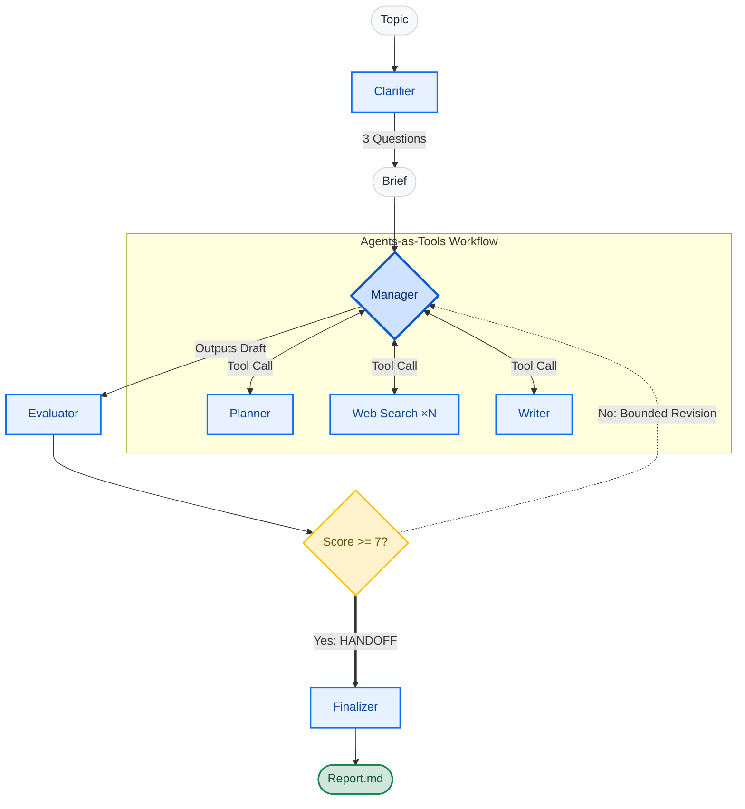

# MultiAgency DeepResearch 🔬

**English** | [Русский](README.ru.md)

> **Autonomous research agent:** Give it a topic → it asks clarifying questions → runs a bounded multi-agent web investigation → writes a report and mathematically grades its own quality before the final handoff.

<div align="center">
  <a href="https://huggingface.co/spaces/ovm26rus/multiagency-deep-research"></a>
  
  
  
  
</div>

<br>

<!-- Убедись, что путь к GIF правильный, и раскомментируй эту строку -->


## 💡 The Value Proposition

Built for complex analytical tasks where single-prompt outputs fail. This system doesn't just generate text; it actively orchestrates a deterministic, auditable research pipeline.

**Real-World Use Cases:**
* **Deep Due Diligence:** Automating initial audits of complex contracts, legal landscapes, or compliance requirements by cross-referencing multiple verified sources.
* **Market Intelligence & Edge Calculation:** Running independent probability assessments and deep-dives into specific market events by aggregating real-time news and financial data.
* **Strategic Briefings:** Compiling comprehensive, fact-checked dossiers on niche technical or business topics with zero hallucinations.

---

## 🏗 Architecture & Orchestration

This system demonstrates precise control over multi-agent orchestration using the **OpenAI Agents SDK**, focusing on deterministic workflows, tool calling, and safe handoffs.



* **Agents-as-Tools Pipeline:** The core loop is driven by a central `Manager` agent. Rather than allowing unpredictable agent-to-agent chatter, the Manager invokes the `Planner`, parallel `Web Search` nodes, and the `Writer` strictly as **tools**. Control consistently returns to the Manager, ensuring predictable execution and debuggability.
* **Evaluator-Optimizer Workflow:** Quality control is deterministic. An `Evaluator` agent grades the draft (0-10). If the score falls below the threshold, a feedback loop sends it back for revision. This loop is strictly bounded by a maximum number of rounds to prevent infinite generation loops.
* **The Single Handoff:** To guarantee process safety, control is transferred exactly once. Only when a report passes evaluation (or hits the iteration limit) does the system execute a **handoff** to the `Finalizer` agent. The Finalizer formats the output and explicitly terminates the process—nothing runs after this point.

---

## 🚀 Quick Start

**Try it now — no install:** [Live Space on Hugging Face](https://huggingface.co/spaces/ovm26rus/multiagency-deep-research) 🤗


**Run locally:**

```bash
git clone [https://github.com/omotsart/multiagency-deep-research](https://github.com/omotsart/multiagency-deep-research)
cd multiagency-deep-research
python -m venv .venv

# Windows: .venv\Scripts\activate | macOS/Linux: source .venv/bin/activate
pip install -r requirements.txt

cp .env.example .env   # Add your OPENAI_API_KEY
python app.py
```

### Dependency Management & Docker Deployment
The app runs as a **Docker Space** (`sdk: docker`, port 7860). When relying on `sdk: gradio`, Hugging Face environments auto-inject `gradio[oauth,mcp]`, which pins `mcp==1.10.1` and causes direct conflict with `openai-agents` (requires `mcp>=1.11.0`). To bypass this and ensure absolute environment stability, the `Dockerfile` installs a bare `gradio` instance strictly from `requirements.txt`. Server host and port are mapped via environment variables, keeping the codebase completely environment-agnostic.

---

## 🧪 Testing

```bash
pip install -r requirements-dev.txt
python -m pytest
```
The test suite includes **54 tests** running entirely on LLM mocks. No real API calls are made during the test lifecycle, and no API key is required to validate the orchestration logic.

---

## 🗺 Roadmap

* [ ] **Privacy-First Local Execution:** Transitioning the evaluator and writer agents to local open-weight models (e.g., Qwen 2.5/3 series) to allow processing of highly sensitive, confidential data without relying on external APIs.
* [ ] **Multi-Modal Document Processing:** Integrating OCR and document parsing capabilities to allow the system to ingest and analyze raw PDFs and legal frameworks natively.
* [ ] **Hybrid RAG Integration:** Connecting the research pipeline directly to vectorized proprietary databases (SQL + Vector) for context-aware internal audits.

---

## 👨‍💻 Engineering Philosophy

*"Structuring data is no different from structuring an argument."*

With 15 years of professional experience navigating complex regulatory and legal frameworks, I view software engineering—especially AI orchestration—through the lens of strict logic and predictability. Navigating dense legal codes requires analytical rigor, fact-checking, and clear paths of logic. I bring that exact same philosophy to AI development. 

This project wasn't built to just "prompt an LLM." It was built to create a deterministic, reliable system that treats AI agents not as magic black boxes, but as modular tools within a highly structured, auditable pipeline.
