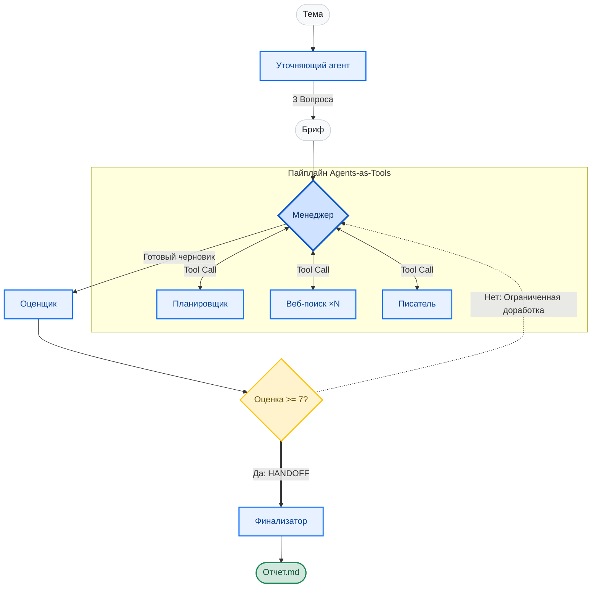

# MultiAgency DeepResearch 🔬

**English** | [Русский](README.ru.md)

> **Автономный исследовательский агент:** Дайте ему тему → он задаст уточняющие вопросы → проведет многоагентное веб-исследование → напишет отчет и математически оценит его качество перед финальной передачей управления (handoff).

<div align="center">
  <a href="https://huggingface.co/spaces/ovm26rus/multiagency-deep-research"></a>
  
  
  
  
</div>

<br>

<!-- Убедись, что путь к GIF правильный, и раскомментируй эту строку -->


## 💡 Ценность проекта (Value Proposition)

Система спроектирована для сложных аналитических задач, где недостаточно генерации текста по одному промпту. Этот проект не просто "пишет текст" — он оркестрирует детерминированный и проверяемый исследовательский пайплайн.

**Сценарии применения в реальных задачах:**
* **Глубокий Due Diligence:** Автоматизация первичного аудита сложных контрактов, правовой среды или требований комплаенса путем кросс-проверки множества надежных источников.
* **Рыночная аналитика и расчет Edge:** Независимая оценка вероятностей и глубокий анализ конкретных рыночных событий путем агрегации новостей и финансовых данных в реальном времени.
* **Стратегические сводки:** Составление комплексных, проверенных на факты досье по узким техническим или бизнес-темам с нулевым уровнем галлюцинаций.

---

## 🏗 Архитектура и оркестрация

Проект демонстрирует точный контроль над многоагентной оркестрацией с использованием **OpenAI Agents SDK**, с упором на детерминированные рабочие процессы (workflows), вызов инструментов (tool calling) и безопасную передачу управления (handoff).



* **Пайплайн Agents-as-Tools:** Ядро системы управляется центральным агентом `Manager`. Вместо того чтобы позволять агентам хаотично общаться друг с другом, Менеджер вызывает Планировщика (`Planner`), параллельные узлы поиска (`Web Search`) и Писателя (`Writer`) строго как **инструменты (tools)**. Управление всегда возвращается к Менеджеру, что обеспечивает предсказуемость выполнения и легкость отладки.
* **Паттерн Evaluator-Optimizer:** Контроль качества полностью детерминирован. Агент `Evaluator` (Оценщик) выставляет черновику оценку от 0 до 10. Если балл ниже порога, включается цикл обратной связи, отправляющий текст на доработку. Этот цикл имеет жесткий лимит итераций, чтобы исключить бесконечную генерацию.
* **Единая передача управления (The Single Handoff):** Для гарантии безопасности процесса управление передается ровно один раз. Только когда отчет проходит оценку (или достигает лимита итераций), система выполняет **handoff** агенту `Finalizer`. Он форматирует результат и явно завершает процесс — после этого этапа не выполняется никакой код.

---

## 🚀 Быстрый старт

**Попробовать сейчас (без установки):** [Live Space на Hugging Face](https://huggingface.co/spaces/ovm26rus/multiagency-deep-research) 🤗


**Запуск локально:**

```bash
git clone [https://github.com/omotsart/multiagency-deep-research](https://github.com/omotsart/multiagency-deep-research)
cd multiagency-deep-research
python -m venv .venv

# Windows: .venv\Scripts\activate | macOS/Linux: source .venv/bin/activate
pip install -r requirements.txt

cp .env.example .env   # Добавьте ваш OPENAI_API_KEY
python app.py
```

### Управление зависимостями и деплой в Docker
Приложение развернуто как **Docker Space** (`sdk: docker`, порт 7860). При использовании `sdk: gradio` среда Hugging Face автоматически внедряет пакет `gradio[oauth,mcp]`, который жестко фиксирует `mcp==1.10.1`, что вызывает прямой конфликт с `openai-agents` (требует `mcp>=1.11.0`). Чтобы обойти это и обеспечить абсолютную стабильность среды, в `Dockerfile` устанавливается чистый экземпляр `gradio` строго из `requirements.txt`. Хост и порт сервера пробрасываются через переменные окружения, делая кодовую базу полностью независимой от среды развертывания.

---

## 🧪 Тестирование

```bash
pip install -r requirements-dev.txt
python -m pytest
```
Пакет тестов включает **54 теста**, которые работают полностью на моках (заглушках) LLM. Во время тестирования не выполняется никаких реальных запросов к API, и для проверки логики оркестрации не требуется API-ключ.

---

## 🗺 Roadmap (Планы развития)

* [ ] **Локальное исполнение (Privacy-First):** Перевод агентов-оценщиков и писателей на локальные open-source модели (например, семейства Qwen 2.5/3), что позволит обрабатывать строго конфиденциальные данные без обращения к внешним API.
* [ ] **Мультимодальная обработка документов:** Интеграция OCR и парсинга документов для того, чтобы система могла нативно поглощать и анализировать "сырые" PDF-файлы и юридические документы.
* [ ] **Интеграция гибридного RAG:** Подключение исследовательского пайплайна напрямую к векторизованным проприетарным базам данных (SQL + Vector) для контекстно-ориентированного внутреннего аудита.

---

## 👨‍💻 Инженерная философия

*"Структурирование данных ничем не отличается от выстраивания правовой аргументации."*

Имея 15 лет профессионального опыта работы в сложной нормативной и правовой среде, я смотрю на разработку программного обеспечения — и в особенности на ИИ-оркестрацию — через призму строгой логики и предсказуемости. Навигация в плотных юридических кодексах требует аналитической строгости, фактчекинга и безупречно выстроенных логических цепочек. Я применяю ровно ту же философию при разработке ИИ.

Этот проект создавался не для того, чтобы просто "отправлять промпты в LLM". Он был написан для создания детерминированной, надежной системы, которая рассматривает ИИ-агентов не как магические черные ящики, а как модульные инструменты внутри жестко структурированного и прозрачного пайплайна.
